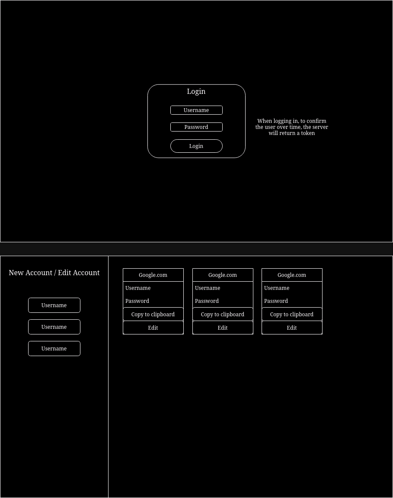

# Web-Password-Manager

A password manager that has a web interface.

## ERD

My password manager will be fairly basic, essentially we will have user models which will store their passwords

- User
	- UserID: String,
	- Username: String,
	- Email: String,
	- PasswordHash: String,
	- Token: String

- Account
	- AccountID: Integer,
	- UserID: Foreign Key to **User**
	- WebsiteName: String,
	- WebsiteURL: String,
	- Username: String,
	- Password: String,

Accounts is the child of User

## What will I use to make this
I will be using the following technologies
- MongoDB
- Crypto Library (For password hashes and tokens)
- Express
I may add more over time.

